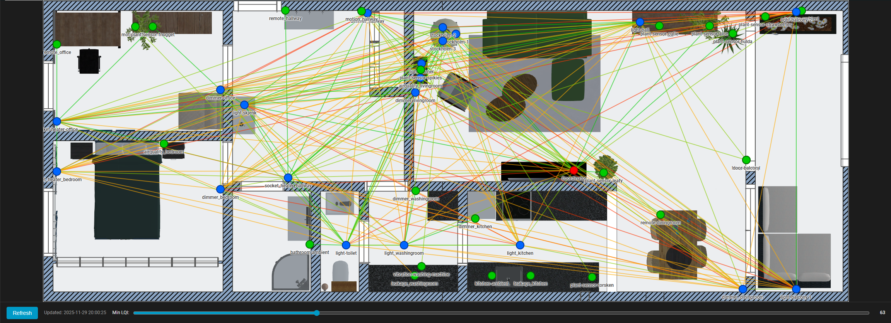
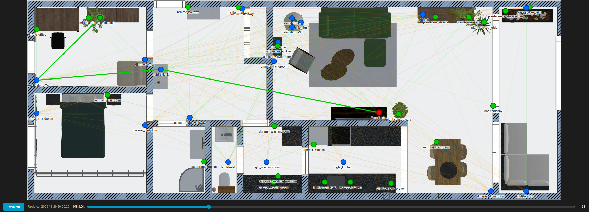

# Zigbee Floorplan Card

A custom Home Assistant Lovelace card that displays your Zigbee network topology overlaid on a floorplan image with automatic device name detection from Zigbee2MQTT.



## Features

- 🏠 Display Zigbee devices on your custom floorplan
- 🔴 Color-coded devices:
  - **Red circles**: Coordinator
  - **Blue circles**: Routers
  - **Green circles**: End devices
- 📊 Visual link quality indicators (LQI) on connections:
  - **Green** (200-255): Excellent
  - **Yellow-green** (150-199): Good
  - **Orange** (100-149): Fair
  - **Red** (0-99): Poor
- 🏷️ Device labels with friendly names from Zigbee2MQTT
- 📈 Automatic network topology visualization
- 🔄 Real-time updates via MQTT
- 🔄 Manual refresh button with timestamp display
- 🎚️ Interactive LQI filter slider to hide weak links
- 🖱️ Click devices to highlight optimal path to coordinator
- 📍 Path-finding algorithm shows best quality routes


Clicking a device will show the theoretical optimal path to the coordinator.

## MQTT Integration

This card uses MQTT to get the complete network map from Zigbee2MQTT, including friendly names. This provides:
- ✅ Automatic friendly names from your Zigbee2MQTT configuration
- ✅ Works for all devices (including routers without entities)
- ✅ Single source of truth (Zigbee2MQTT)
- ✅ Accurate device types and network topology

## Quick Start

See [QUICKSTART.md](docs/QUICKSTART.md) for a step-by-step guide to get started!

## Installation

### Step 1: Install the Card

#### Method 1: Manual Installation

1. Download `zigbee-floorplan-card.js` to your Home Assistant's `www` folder:
   ```
   /config/www/zigbee-floorplan-card.js
   ```

2. Add the resource to your Lovelace dashboard:
   - Go to **Settings** → **Dashboards** → **Resources**
   - Click **Add Resource**
   - Set URL to: `/local/zigbee-floorplan-card.js`
   - Set Resource type to: **JavaScript Module**
   - Click **Create**

#### Method 2: HACS (if available)

1. Add this repository as a custom repository in HACS
2. Search for "Zigbee Floorplan Card" and install
3. Add the resource to Lovelace (HACS should do this automatically)

[](https://my.home-assistant.io/redirect/hacs_repository/?owner=TheLarsinator&repository=https%3A%2F%2Fgithub.com%2FTheLarsinator%2Fzigbee-floorplan-card%2F)

### Step 2: Setup MQTT Sensor

Note: If you already use the https://github.com/azuwis/zigbee2mqtt-networkmap card, you already have a compatible entity.

Add this to your `configuration.yaml`:

```yaml
mqtt:
  sensor:
    - name: Zigbee2mqtt Networkmap
      state_topic: zigbee2mqtt/bridge/response/networkmap
      value_template: >-
        {{ now().strftime('%Y-%m-%d %H:%M:%S') }}
      json_attributes_topic: zigbee2mqtt/bridge/response/networkmap
      json_attributes_template: "{{ value_json.data.value | tojson }}"
```

**Note:** If you use a custom Zigbee2MQTT `base_topic`, replace `zigbee2mqtt` in both topics above.

### Step 3: Add Automation

Add this to request the network map periodically:

```yaml
automation:
  - alias: "Request Zigbee Network Map"
    trigger:
      - platform: time
        at: "00:00:00"  # Once per day at midnight
      - platform: homeassistant
        event: start  # On Home Assistant start
    action:
      - service: mqtt.publish
        data:
          topic: zigbee2mqtt/bridge/request/networkmap
          payload: '{"type": "raw", "routes": true}'
```

### Step 4: Restart Home Assistant

After adding the sensor and automation, restart Home Assistant.

**Detailed setup instructions**: See [MQTT-SETUP.md](docs/MQTT-SETUP.md)

## Configuration

### Prerequisites

- Zigbee2MQTT 1.17.0 or later
- MQTT integration configured
- Floorplan image uploaded to `/config/www/`

### Friendly Names

Device names come directly from your Zigbee2MQTT configuration:
- Set friendly names in Zigbee2MQTT (web UI or configuration file)
- Names automatically appear in the card
- No manual mapping required!

To set friendly names in Zigbee2MQTT:
1. Open Zigbee2MQTT web interface
2. Click on a device
3. Edit "Friendly name" field
4. Save

### Basic Configuration

Add this to your Lovelace dashboard:

```yaml
type: custom:zigbee-floorplan-card
entity: sensor.zigbee2mqtt_networkmap
image: /local/floorplan.png
device_coordinates:
  "0xbc026efffe29c7de": { x: 500, y: 400 }  # Coordinator
  "0x001788010d5caf75": { x: 200, y: 200 }  # Living Room Light
  # ... more devices
```

### Full Configuration Example

```yaml
type: custom:zigbee-floorplan-card
entity: sensor.zigbee2mqtt_networkmap
image: /local/floorplan.png
image_width: 1000
image_height: 800
circle_radius: 10
show_labels: true
show_link_lqi: false
mqtt_base_topic: zigbee2mqtt
device_coordinates:
  "0xbc026efffe29c7de": { x: 500, y: 400 }
  "0x001788010d5caf75": { x: 200, y: 200 }
  "0x00158d0001a2b3c4": { x: 700, y: 300 }
friendly_names:
  "0x001788010d5caf75": "Living Room Light (Override)"
```

See [configuration-example.yaml](examples/configuration-example.yaml) for more examples.

### Configuration Options

| Option | Type | Required | Default | Description |
|--------|------|----------|---------|-------------|
| `entity` | string | **Yes** | - | Entity ID of the MQTT network map sensor |
| `image` | string | **Yes** | - | Path to floorplan image (e.g., `/local/floorplan.png`) |
| `device_coordinates` | object | **Yes** | - | Map of IEEE addresses to x,y coordinates |
| `image_width` | number | No | 1000 | Width of the floorplan image in pixels |
| `image_height` | number | No | 800 | Height of the floorplan image in pixels |
| `circle_radius` | number | No | 10 | Radius of device circles in pixels |
| `show_labels` | boolean | No | true | Show device labels |
| `show_link_lqi` | boolean | No | false | Show link quality values on connections |
| `mqtt_base_topic` | string | No | zigbee2mqtt | Zigbee2MQTT MQTT base topic |
| `friendly_names` | object | No | {} | Manual device name overrides |
| `auto_friendly_names` | boolean | No | true | Automatically lookup friendly names from Home Assistant entities |
| `friendly_names` | object | No | {} | Map of IEEE addresses to friendly names (overrides auto-lookup) |

## Getting Device IEEE Addresses

To find the IEEE addresses of your Zigbee devices:

### Zigbee2MQTT:

1. Go to **Settings** → **Devices & Services** → **MQTT**
2. Click on your Zigbee2MQTT integration
3. View device information to find IEEE addresses (format: `0x...`)

Or check the Zigbee2MQTT frontend at `http://homeassistant:8123/...`

### ZHA:

1. Go to **Settings** → **Devices & Services** → **Zigbee Home Automation**
2. Click on a device
3. Find the IEEE address in device information

### From the Network Map Entity:

1. Go to **Developer Tools** → **States**
2. Find your network map entity (e.g., `sensor.zigbee_coordinator_networkmap`)
3. View the attributes to see all devices and their IEEE addresses

## Setting Up Device Coordinates

### Method 1: Visual Measurement

1. Open your floorplan image in an image editor (GIMP, Photoshop, Paint.NET, etc.)
2. Enable the coordinate display/ruler
3. Click on the location where you want each device
4. Note the x,y pixel coordinates
5. Add them to your configuration

### Method 2: Trial and Error

1. Start with estimated coordinates
2. View the card in Home Assistant
3. Adjust coordinates based on where devices appear
4. Reload the card to see changes

### Tips for Coordinates:

- Origin (0,0) is the top-left corner
- X increases going right
- Y increases going down
- Place the coordinator centrally
- Distribute routers evenly around your space
- Place end devices at their actual physical locations

## Example: Creating Your Floorplan

1. **Get a floorplan image**:
   - Draw one using any drawing tool
   - Use architectural plans
   - Take a photo and trace over it
   - Use online floorplan tools

2. **Optimize the image**:
   - Save as PNG or JPG
   - Recommended size: 800-1200px wide
   - Keep file size reasonable (<2MB)

3. **Upload to Home Assistant**:
   ```
   /config/www/floorplan.png
   ```

4. **Map your devices**:
   - List all IEEE addresses from your Zigbee network
   - Determine x,y coordinates for each device location
   - Add to configuration

## Troubleshooting

### Card not showing

- Check that the resource is properly loaded in Lovelace Resources
- Clear browser cache (Ctrl+Shift+R)
- Check browser console for errors (F12)

### Entity not found

- Verify the entity ID in Developer Tools → States
- Ensure Zigbee2MQTT or ZHA integration is working
- Check that network map is enabled in your Zigbee integration

### Devices not appearing

- Verify IEEE addresses match exactly (case-sensitive)
- Check that coordinates are within image bounds
- Ensure the entity has `links` attribute with network data

### Device names showing as 4-digit codes

The card falls back to showing the last 4 characters of the IEEE address when it can't find the device name. To fix:

1. **Check browser console** (F12) - Look for `[Zigbee Floorplan]` messages
2. **Verify entity attributes** - Go to Developer Tools → States, find your devices and check if they have `ieee_address` attribute
3. **Try manual names** - Add the device to `friendly_names` configuration:
   ```yaml
   friendly_names:
     '0xbc026efffe29c7de': 'My Device Name'
   ```
4. **Enable debug logging** - The console will show which devices were found and which weren't

### Links not showing

- Verify the entity attributes contain link data
- Check that both source and target devices have coordinates defined
- Ensure LQI data is present in the links

### Image not loading

- Verify image path (should be `/local/filename.png`)
- Check file exists in `/config/www/`
- Try accessing image directly: `http://your-ha-ip:8123/local/floorplan.png`

### Advanced Usage

### Auto-Friendly Names

By default, the card automatically looks up friendly names from Home Assistant entities. The lookup priority is:

1. **Manual override**: Names specified in `friendly_names` config
2. **Entity attributes**: Searches for entities with matching `ieee_address` attribute
3. **Fallback**: Last 4 characters of IEEE address

To disable automatic lookup:
```yaml
auto_friendly_names: false
```

### Manual Friendly Name Override

You can manually specify names that will override the auto-lookup:

```yaml
friendly_names:
  '0xbc026efffe29c7de': 'Main Coordinator'  # Overrides auto-detected name
  '0x001788010d5caf75': 'Living Room Plug'
```

### Dynamic Friendly Names

You can use Home Assistant entity names as friendly names:

```yaml
friendly_names:
  '0xbc026efffe29c7de': 'Coordinator'
  '0x001788010d5caf75': '{{ states("sensor.living_room_router") }}'
```

### Multiple Floors

Create separate cards for each floor with different floorplan images:

```yaml
- type: custom:zigbee-floorplan-card
  entity: sensor.zigbee_coordinator_networkmap
  image: /local/floor1.png
  title: First Floor
  device_coordinates: { ... }

- type: custom:zigbee-floorplan-card
  entity: sensor.zigbee_coordinator_networkmap
  image: /local/floor2.png
  title: Second Floor
  device_coordinates: { ... }
```

### Custom Styling

The card uses CSS classes that can be customized via card-mod:

- `.coordinator` - Coordinator circles
- `.router` - Router circles
- `.end-device` - End device circles
- `.link` - Connection lines
- `.device-label` - Device labels
- `.lqi-label` - LQI value labels

## Contributing

Feel free to submit issues and enhancement requests!

## License

MIT License
